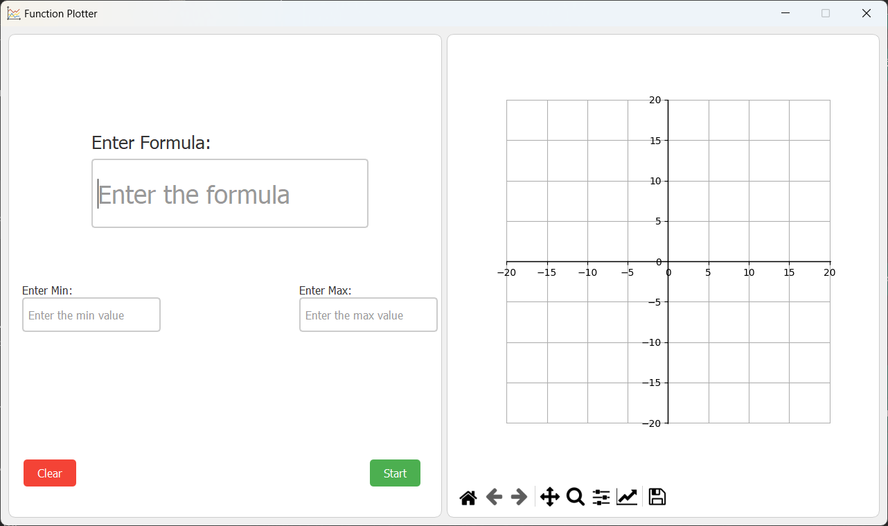
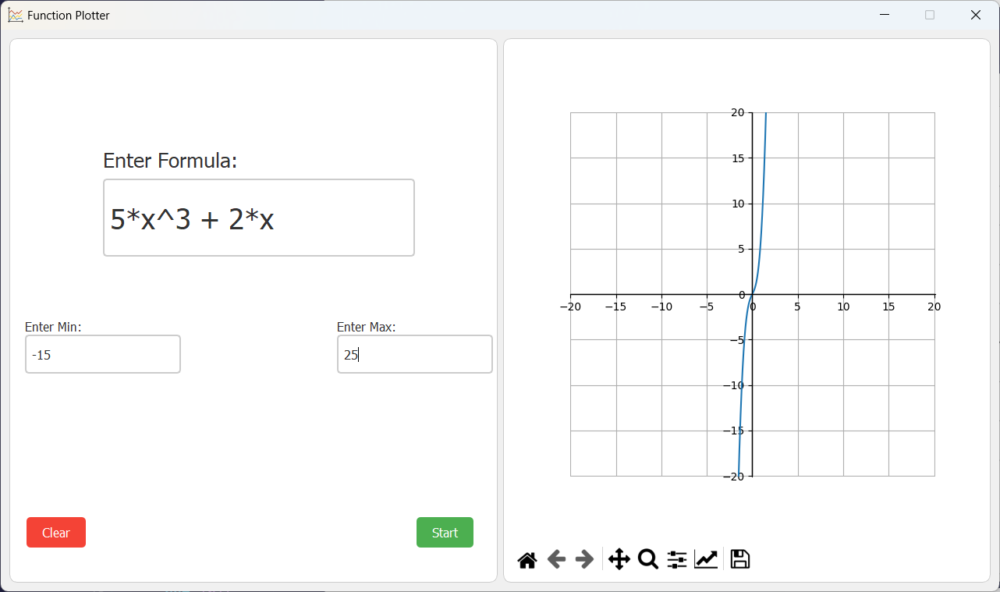
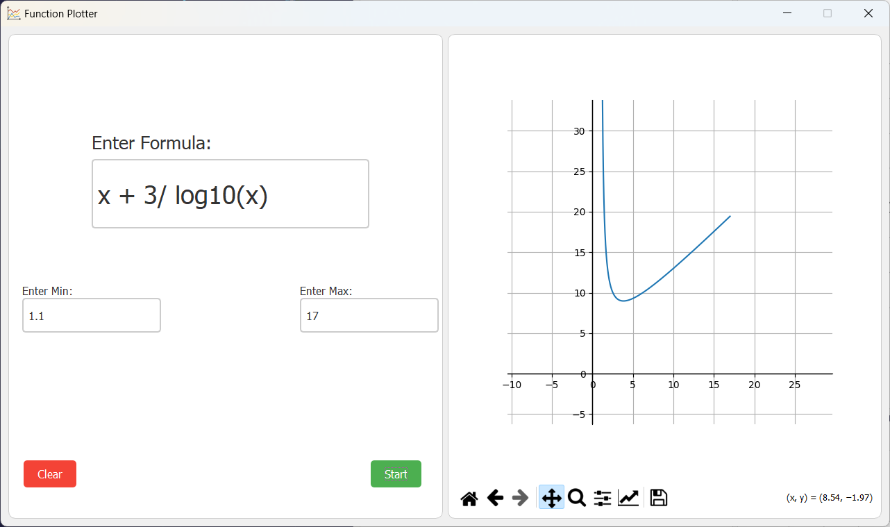
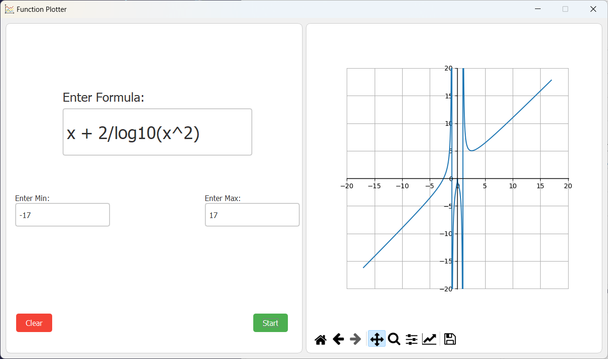
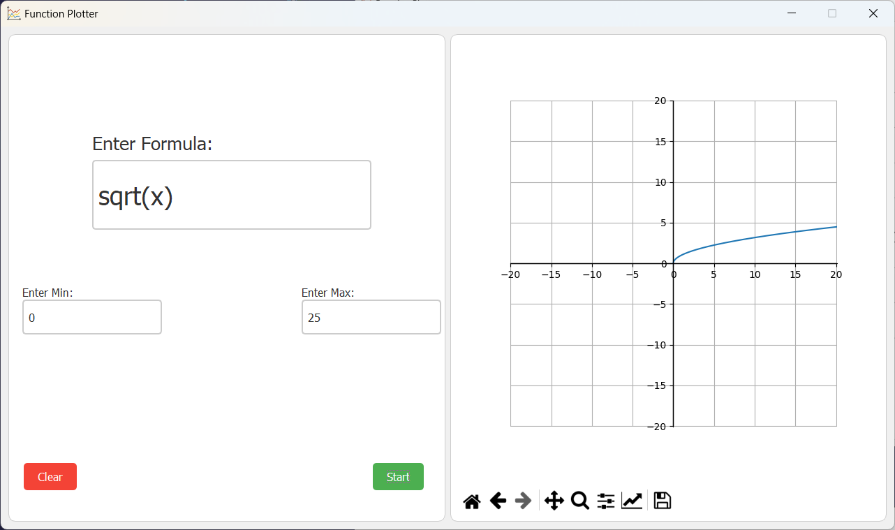
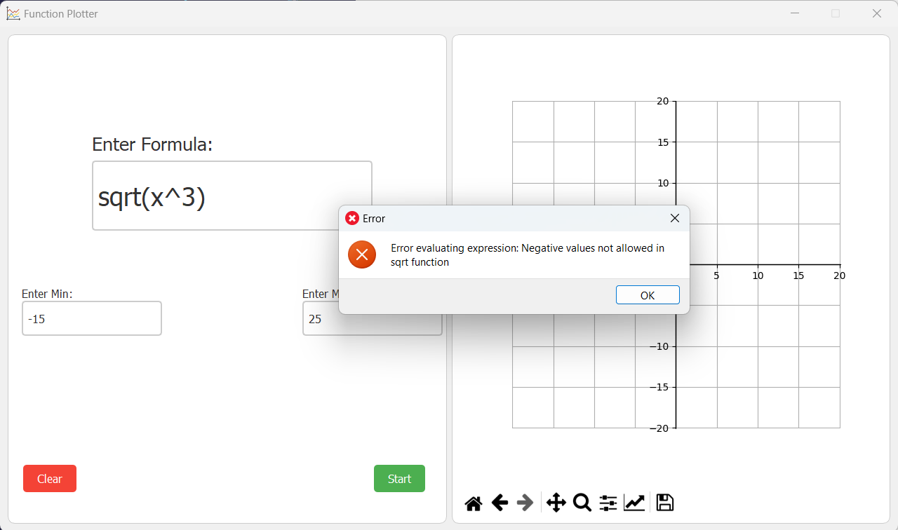
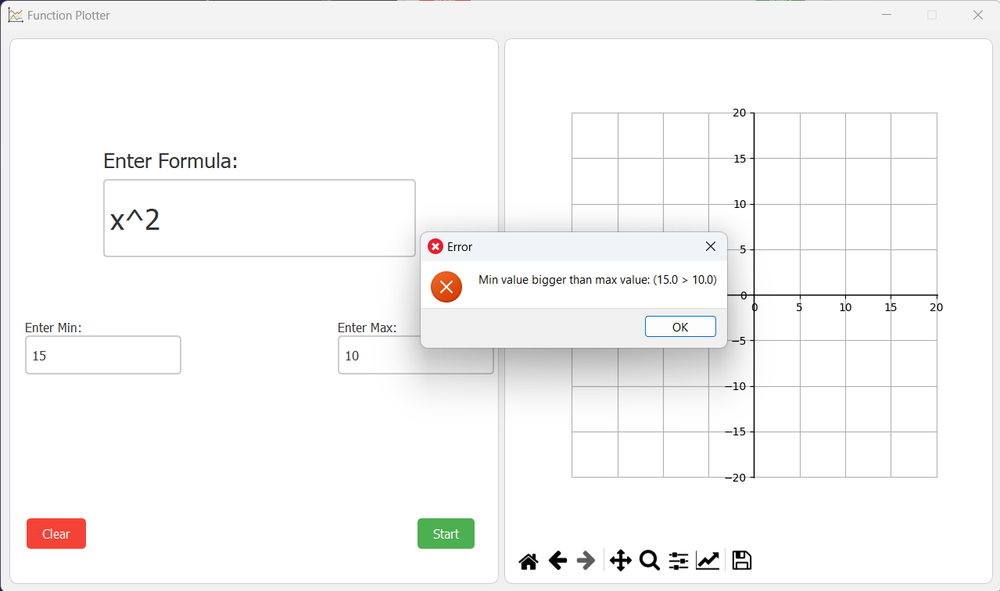

# Function Plotter GUI Application

This is a Python GUI application that lets users plot mathematical function of `x`. Automated testing and input validation ensures the user input is correct. The GUI is built using PySide2 and the plots are generated using Matplotlib.
Currently supports these operators + - / * ^ log10() sqrt() and is immune to command injection.

## Dependencies

- Python < 3.11
- PySide2
- matplotlib
- numpy
- pytest-qt

## Installation

1. Clone the repo:
```
git clone https://github.com/gimmeursocks/gui-function-plotter.git
cd gui-function-plotter
```
2. Install dependencies:
```
pip install PySide2 matplotlib numpy
```

## Usage

1. Run program:
```
python app.py
```
2. Enter the formula, min & max and press Enter or click Start


## Automated Tests

1. Install testing dependencies:
```
pip install pytest pytest-qt
```

2. Run the tests:
```
pytest
```

## Examples


### Working Examples






### Wrong Examples





